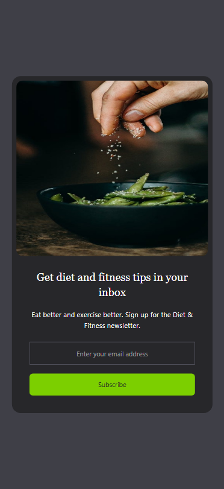

# Email Subscribe Card

This project is a responsive email subscription card built with HTML and Tailwind CSS. It features a simple interface with an image, a heading, a description, an email input field, and a subscribe button. The layout adapts to mobile and desktop screens using Tailwind's responsive design utilities.

## Project Structure

`index.html` The main HTML file containing the structure of the email subscription card.

`css/style.css` The CSS file generated by Tailwind CSS for styling the card.

`images/image.jpg` A placeholder image displayed alongside the subscription form.

`screenshots/` Folder containing screenshots of the mobile and desktop views (to be added).

## Features

Responsive Design: The card adjusts its layout for mobile and desktop views using Tailwind CSS flexbox utilities.

Interactive Elements: The image scales on hover, and the subscribe button changes color on hover with smooth transitions.

Accessible Styling: Uses semantic HTML and clear text for accessibility.

## Screenshots

Below are the mobile and desktop views of the email subscription card:




## Prerequisites

Node.js (v16 or higher) and npm installed on your machine.

A modern web browser (e.g., Chrome, Firefox, Edge).

## Installation and Setup

Follow these steps to set up and run the project locally:

### Clone the Repository

Clone the project from GitHub to your local machine:

`git clone <repository-url>`

### Navigate to the Project Directory

Change to the project folder:

`cd Tailwinds-Mini-Projects/Email-Subscribe-Card/`

### Install Dependencies

Install the required dependencies (e.g., Tailwind CSS) using npm:

`npm i`

### Build the Project

Run the watch script to compile Tailwind CSS and watch for changes:

`npm run watch`

This generates the `css/style.css` file from your Tailwind configuration.

### Run the Project

Open the `index.html` file in a web browser. You can do this by:

Double-clicking `index.html` in your file explorer, or

Using a local development server for a better experience:

```
npm install -g live-server
live-server
```

This will open the project in your default browser at http://localhost:8080.

## Usage

Open the project in a browser to view the email subscription card.

The card displays an image (replace images/image.jpg with your own image) and a form to enter an email address.

On mobile devices, the layout stacks vertically; on desktop, the image and form are side by side.

Hover over the image for a scaling effect, or hover over the subscribe button for a color transition.

## Notes

Image Placeholder: Replace `images/image.jpg` with an actual image file in the `images/` directory, or update the src attribute in index.html to point to a valid image URL.

Customization: Modify the Tailwind classes in index.html or update `css/style.css` to adjust styling (e.g., colors, fonts).

Form Functionality: The current code includes a static form. To make the subscribe button functional, you’ll need to add JavaScript and a backend service (e.g., for handling email subscriptions).

## Troubleshooting

Styles Not Applied: Ensure npm run watch is running to generate css/style.css. Verify that css/style.css is correctly linked in index.html.

Image Not Found: Check that the images/image.jpg file exists or update the src attribute in index.html.

Screenshots Not Displaying: Ensure the screenshot files are in the screenshots/ folder and the Markdown paths in the README are correct.

Responsive Issues: Test the page in different screen sizes to ensure Tailwind’s responsive classes (md:) work as expected.
