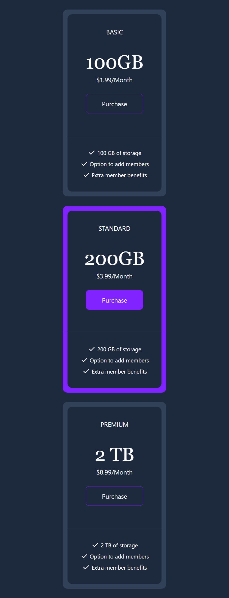
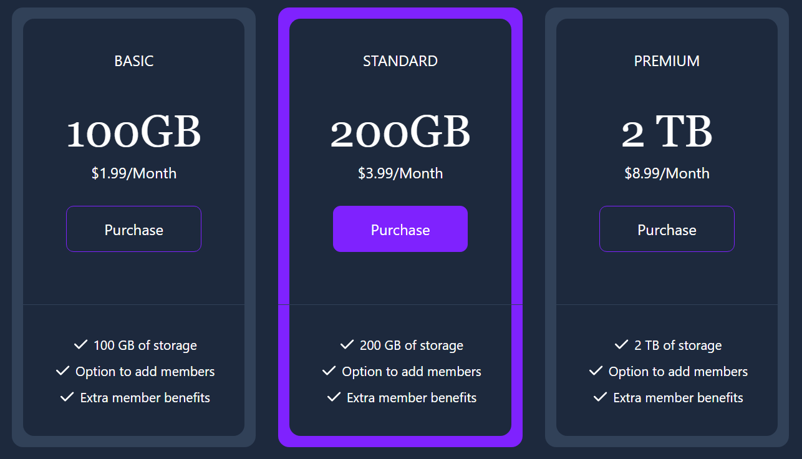

# Pricing Cards

This project is a responsive pricing cards interface built with HTML and Tailwind CSS. It features three pricing tiers (Basic, Standard, Premium) with details on storage, pricing, and benefits, each with a purchase button. The layout adapts to mobile and desktop screens using Tailwind's responsive design utilities.

## Project Structure

`index.html` The main HTML file containing the structure of the pricing cards.

`css/style.css` The CSS file generated by Tailwind CSS for styling the cards.

`images/` Folder for image assets (to be added if used).

## Features

Responsive Design: The cards stack vertically on mobile and align horizontally on desktop using Tailwind CSS flexbox utilities.

Interactive Elements: Purchase buttons change background and border color on hover with smooth transitions.

Accessible Styling: Uses semantic HTML and clear text for accessibility.

## Screenshots

Below are the mobile and desktop views of the pricing cards:





## Prerequisites

Node.js (v16 or higher) and npm installed on your machine.

A modern web browser (e.g., Chrome, Firefox, Edge).

## Installation and Setup

Follow these steps to set up and run the project locally:

### Clone the Repository

Clone the project from GitHub to your local machine:

`git clone <repository-url>`

### Navigate to the Project Directory

Change to the project folder:

`cd Tailwinds-Mini-Projects/Pricing-Cards/`

### Install Dependencies

Install the required dependencies (e.g., Tailwind CSS) using npm:

`npm i`

### Build the Project

Run the watch script to compile Tailwind CSS and watch for changes:

`npm run watch`

This generates the `css/style.css` file from your Tailwind configuration.

### Run the Project

Open the `index.html` file in a web browser. You can do this by:

Double-clicking `index.html` in your file explorer, or

Using a local development server for a better experience:

```
npm install -g live-server
live-server
```

This will open the project in your default browser at http://localhost:8080.

## Usage

Open the project in a browser to view the pricing cards.

The cards display three tiers (Basic: 100GB, Standard: 200GB, Premium: 2TB) with pricing and benefits.

On mobile devices, the cards stack vertically; on desktop, they align side by side.

Hover over the purchase buttons for a color transition effect.

## Notes

Image Placeholder: If images are used (e.g., for card backgrounds or icons), place them in the `images/` directory and update `index.html` to reference them.

Customization: Modify the Tailwind classes in index.html or update `css/style.css` to adjust styling (e.g., colors, fonts).

Button Functionality: The purchase buttons are static. To make them functional, add JavaScript and a backend service (e.g., for processing payments).

## Troubleshooting

Styles Not Applied: Ensure npm run watch is running to generate css/style.css. Verify that css/style.css is correctly linked in index.html.

Image Not Found: If using images, check that they exist in the images/ folder or update the src attribute in index.html.

Screenshots Not Displaying: Ensure the screenshot files are in the screenshots/ folder and the Markdown paths in the README are correct.

Responsive Issues: Test the page in different screen sizes to ensure Tailwind’s responsive classes (md:) work as expected.
