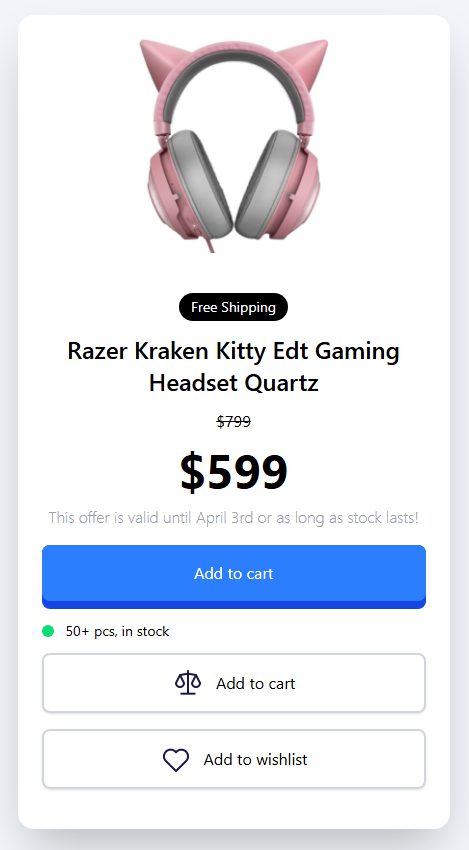
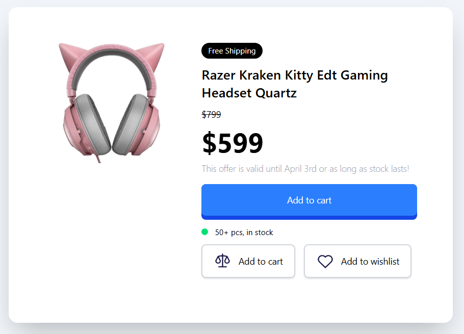

# Product Modal

This project is a responsive product modal built with HTML and Tailwind CSS. It features a product card for a gaming headset with an image, pricing details, stock status, and interactive buttons. The layout adapts to mobile and desktop screens using Tailwind's responsive design utilities.

## Project Structure

`index.html` The main HTML file containing the structure of the product modal.

`css/style.css` The CSS file generated by Tailwind CSS for styling the modal.

`images/headphone.png` Image of the gaming headset displayed in the modal.

`images/weight.png` Icon for the "Add to cart" button.

`images/heart.png` Icon for the "Add to wishlist" button.

## Features

Responsive Design: The modal stacks vertically on mobile and aligns horizontally on desktop using Tailwind CSS flexbox utilities.

Interactive Elements: The product image scales on hover, buttons transform on hover with smooth transitions, and the stock indicator animates.

Accessible Styling: Uses semantic HTML and clear text for accessibility.

## Screenshots

Below are the mobile and desktop views of the product modal:





## Prerequisites

Node.js (v16 or higher) and npm installed on your machine.

A modern web browser (e.g., Chrome, Firefox, Edge).

## Installation and Setup

Follow these steps to set up and run the project locally:

### Clone the Repository

Clone the project from GitHub to your local machine:

`git clone <repository-url>`

### Navigate to the Project Directory

Change to the project folder:

`cd Tailwinds-Mini-Projects/Product-Modal/`

### Install Dependencies

Install the required dependencies (e.g., Tailwind CSS) using npm:

`npm i`

### Build the Project

Run the watch script to compile Tailwind CSS and watch for changes:

`npm run watch`

This generates the `css/style.css` file from your Tailwind configuration.

### Run the Project

Open the `index.html` file in a web browser. You can do this by:

Double-clicking `index.html` in your file explorer, or

Using a local development server for a better experience:

```
npm install -g live-server
live-server
```

This will open the project in your default browser at http://localhost:8080.

## Usage

Open the project in a browser to view the product modal.

The modal displays a gaming headset image, pricing details (original and discounted), stock status, and buttons for adding to cart or wishlist.

On mobile devices, the layout stacks vertically; on desktop, the image and text content are side by side.

Hover over the product image for a scaling effect, or hover over buttons for transformation and animation effects.

## Notes

Image Placeholder: Ensure `images/headphone.png`, `images/weight.png`, and `images/heart.png` exist in the `images/` directory, or update the src attributes in `index.html` to point to valid image URLs.

Customization: Modify the Tailwind classes in `index.html` or update `css/style.css` to adjust styling (e.g., colors, fonts).

Button Functionality: The buttons are static. To make the "Add to cart" and "Add to wishlist" buttons functional, add JavaScript and a backend service (e.g., for cart or wishlist management).

## Troubleshooting

Styles Not Applied: Ensure npm run watch is running to generate css/style.css. Verify that css/style.css is correctly linked in index.html.

Image Not Found: Check that images/headphone.png, images/weight.png, and images/heart.png exist or update the src attributes in index.html.

Screenshots Not Displaying: Ensure the screenshot files are in the screenshots/ folder and the Markdown paths in the README are correct.

Responsive Issues: Test the page in different screen sizes to ensure Tailwind’s responsive classes (md:) work as expected.
